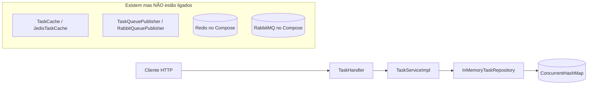
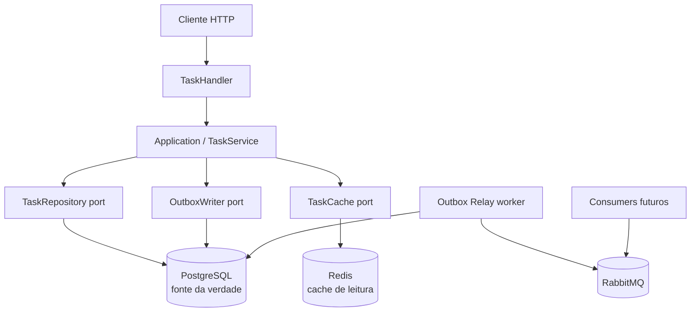
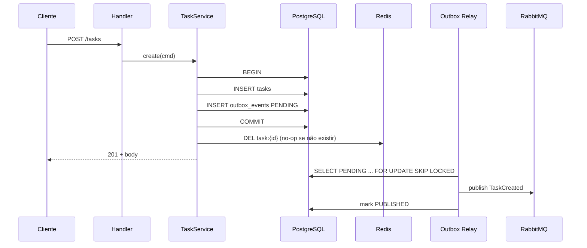

# Arquitetura V2 — Task Management API

Documento de **arquitetura alvo** (apenas especificação). Não altera o código atual.
Destinado a aprendizado (nível iniciante/intermediário) e como referência para o roadmap de microtarefas.

**Projeto:** `01-simple-rest-api-task-management`  
**Stack alvo:** Java 21 · HTTP Server nativo · PostgreSQL · Redis · RabbitMQ · Docker Compose / K8s

---

## 1. Estado atual vs arquitetura alvo

### 1.1 Estado atual (V1)



| Aspecto | V1 hoje |
|--------|---------|
| Fonte da verdade | `ConcurrentHashMap` por processo |
| Cache Redis | Adapter existe; **não wired** |
| Fila RabbitMQ | Adapter existe; **não wired** |
| Escalabilidade | `replicas: 3` incompatível com memória local |
| Dual-write | Não há (porque Redis/Rabbit não entram no fluxo) |
| Consistência entre pods | **Quebrada** se escalar |

### 1.2 Arquitetura alvo (V2)



**Princípios V2**

1. **PostgreSQL é a única fonte da verdade** para dados de Task.
2. **Redis é cache de leitura**, nunca a autoridade do dado.
3. **Eventos saem via transactional outbox** (mesma transação do DB), não com “escreve DB + publica fila” separados.
4. **Um processo pode ter N réplicas**: todos compartilham o mesmo Postgres (e o mesmo Redis como cache).

---

## 2. Padrão escolhido para evitar escrita duplicada

### 2.1 O problema do dual-write

Escrita duplicada (dual-write) acontece quando o serviço faz **duas escritas em sistemas distintos sem uma única transação**:

```text
1) INSERT/UPDATE na Task no PostgreSQL  ✅
2) SET no Redis                            ❓ pode falhar
3) basicPublish no RabbitMQ                ❓ pode falhar
```

Se (1) ok e (2)/(3) falham → DB certo, cache velho ou evento perdido.  
Se (3) ok e (1) rollback → evento fantasma.  
Com várias réplicas, o problema piora.

### 2.2 Padrão adotado: **DB como fonte da verdade + Transactional Outbox + invalidação de cache**

| Peça | Papel |
|------|--------|
| **PostgreSQL** | Persistência autoritativa de `tasks` + tabela `outbox_events` |
| **Transactional Outbox** | Na **mesma** transação do CRUD, grava o evento pendente |
| **Outbox Relay** | Processo/thread que lê outbox e publica no RabbitMQ (at-least-once) |
| **Redis** | Cache de leitura; **invalida** (DEL) após commit bem-sucedido — não “escreve o objeto” como segunda fonte |

#### Por que este padrão (e não outros) neste nível?

| Padrão | Usar agora? | Motivo |
|--------|-------------|--------|
| **Transactional Outbox** | **Sim** | Ensinável com JDBC + tabela; resolve DB↔fila sem 2PC |
| **Cache-aside + invalidação** | **Sim** | Simples: miss → DB; após write → DEL chave |
| CDC (Debezium) | Não | Operacionalmente pesado para lab iniciante |
| Inbox / saga completa | Não | Overkill para um bounded context de tasks |
| Write-through Redis | Evitar | Redis vira quase segunda fonte; dual-write disfarçado |
| Two-phase commit (XA) | Evitar | Complexo e raro em apps modernas deste porte |

**Resumo da regra de ouro V2:**  
> Só o PostgreSQL participa da transação de negócio. Redis e RabbitMQ são **efeitos colaterais derivados** (invalidação pós-commit e publicação via outbox).

---

## 3. Bounded context, camadas e ports

### 3.1 Bounded context

Um único contexto: **Task Management** (CRUD de tarefas pessoais/lab).  
Sem multi-tenancy nem billing neste nível.

### 3.2 Camadas alvo (Clean / Hexagonal)

```text
infra/web          → adapters de entrada (HTTP, DTOs, JSON)
application/       → casos de uso (TaskService / comandos-consultas)
domain/            → Task, exceções, regras de invariante
domain/contract/   → ports (Repository, OutboxWriter, TaskCache)
infra/persistence  → PostgresTaskRepository, OutboxJdbcWriter
infra/cache        → Jedis/Lettuce TaskCache (pool + TTL)
infra/messaging    → OutboxRelay, RabbitPublisher
infra/config       → wiring (Main / composition root)
```

### 3.3 Ports novos / ajustados

| Port | Responsabilidade |
|------|------------------|
| `TaskRepository` | CRUD + listagem filtrada/paginada no Postgres (dentro de tx) |
| `OutboxWriter` | Insere evento na `outbox_events` **na mesma conexão/tx** |
| `TaskCache` | `get`, `put` (opcional em miss), `evict` / `evictAll` |
| `UnitOfWork` / tx boundary | Abrir/commitar/rollback (pode ser abstração fina sobre `Connection`) |

> `TaskQueuePublisher` **deixa de ser chamado direto pelo caso de uso**. Quem publica na fila é o **Outbox Relay**.

### 3.4 Responsabilidade do Application Service (exemplo conceitual)

Para `create` / `update` / `delete` (comando):

1. Abrir transação.
2. Validar / aplicar regras de domínio (`Task.create`, withers).
3. Persistir via `TaskRepository`.
4. Escrever outbox (`TaskCreated` / `TaskUpdated` / `TaskDeleted`).
5. Commit.
6. **Depois do commit:** `TaskCache.evict(id)` (e, se listagens forem cacheadas, invalidar chaves de lista).
7. Retornar DTO/resposta.

Para `get` / `list` (consulta):

1. Tentar cache (get por id).
2. Miss → buscar no Postgres → opcionalmente `put` no Redis com TTL → retornar.
3. Listagem: preferir **sempre Postgres** no início (paginação); cache de lista só depois, se necessário.

---

## 4. Modelo de dados (PostgreSQL)

### 4.1 Tabela `tasks`

```sql
CREATE TABLE tasks (
    id          UUID PRIMARY KEY,
    title       VARCHAR(200) NOT NULL,
    completed   BOOLEAN NOT NULL DEFAULT FALSE,
    created_at  TIMESTAMPTZ NOT NULL DEFAULT NOW(),
    updated_at  TIMESTAMPTZ NOT NULL DEFAULT NOW(),
    CONSTRAINT tasks_title_not_blank CHECK (char_length(trim(title)) > 0)
);

CREATE INDEX idx_tasks_completed ON tasks (completed);
CREATE INDEX idx_tasks_created_at ON tasks (created_at DESC);
```

| Coluna | Notas |
|--------|--------|
| `id` | UUID alinhado ao domínio atual (`Task` usa String id — migrar para UUID ou manter VARCHAR(36)) |
| `title` | Limite alinhado à validação de domínio |
| `completed` | Índice para filtro `?completed=` |
| `created_at` / `updated_at` | Auditoria simples; `updated_at` atualizado em todo update |

### 4.2 Tabela `outbox_events`

```sql
CREATE TABLE outbox_events (
    id             BIGSERIAL PRIMARY KEY,
    aggregate_type VARCHAR(64) NOT NULL,   -- 'Task'
    aggregate_id   VARCHAR(36) NOT NULL,
    event_type     VARCHAR(64) NOT NULL,   -- TaskCreated | TaskUpdated | TaskDeleted
    payload        JSONB NOT NULL,
    created_at     TIMESTAMPTZ NOT NULL DEFAULT NOW(),
    published_at   TIMESTAMPTZ NULL,
    STATUS         VARCHAR(16) NOT NULL DEFAULT 'PENDING'
        CHECK (status IN ('PENDING', 'PUBLISHED', 'FAILED'))
);

CREATE INDEX idx_outbox_pending ON outbox_events (status, created_at)
    WHERE status = 'PENDING';
```

**Payload (exemplo conceitual):** evento versionado, **não** a entidade de domínio crua serializada sem contrato:

```json
{
  "eventType": "TaskCreated",
  "eventVersion": 1,
  "occurredAt": "2026-10-06T22:00:00Z",
  "taskId": "...",
  "title": "...",
  "completed": false
}
```

### 4.3 Migrações

Usar ferramenta de migração (Flyway ou Liquibase) com scripts versionados em `src/main/resources/db/migration`.  
Primeira migração: `tasks` + `outbox_events`. Sem “criar tabela no código em runtime”.

---

## 5. Fluxos detalhados

### 5.1 Create



### 5.2 Update / Patch / Delete

Mesma estrutura: **tx (repo + outbox) → commit → evict cache**.  
Delete: soft-delete **não** é requisito V2; hard delete + evento `TaskDeleted` basta para o lab.

### 5.3 Get by id

```text
1. Redis GET task:{id}
2. Hit → retorna
3. Miss → SELECT no Postgres
4. Se encontrado → SET task:{id} com TTL (ex.: 60s) → retorna
5. Se não → 404 (não cachear 404 por muito tempo, ou TTL curto)
```

### 5.4 List

```text
1. Query Postgres com filtros + LIMIT/OFFSET (ou keyset)
2. Não depender de Redis para listagem na primeira entrega
3. (Opcional depois) cache de páginas com chave que inclui filtro+página — invalidar em qualquer write
```

### 5.5 Outbox Relay (worker)

- Loop periódico (ex.: a cada 500ms–2s) ou `LISTEN/NOTIFY` (avançado; opcional).
- `SELECT ... WHERE status = 'PENDING' ORDER BY id FOR UPDATE SKIP LOCKED LIMIT N`.
- Publica no exchange/fila Rabbit.
- Marca `PUBLISHED` + `published_at`.
- Em falha de broker: deixa `PENDING` ou marca `FAILED` com retry/backoff (documentar política simples: retry infinito com backoff + alerta).
- **At-least-once:** consumers devem ser idempotentes (chave `event id` / `aggregate_id + event_type + version`).

### 5.6 Múltiplas réplicas da API

| Componente | Comportamento com N pods |
|------------|---------------------------|
| PostgreSQL | Compartilhado — consistente |
| Redis | Compartilhado — cache coerente via invalidação |
| Outbox Relay | **Uma** instância líder **ou** várias com `SKIP LOCKED` (ambas ok) |
| InMemory | **Removido** da arquitetura alvo |

`deployment.yaml` pode voltar a `replicas: 3` **somente depois** de Postgres (e Redis compartilhado) estarem no caminho crítico.

---

## 6. Redis e RabbitMQ — papéis claros

### 6.1 Redis

- **É:** cache-aside de leitura (`task:{id}`), TTL obrigatório, pool thread-safe (`JedisPooled` / Lettuce).
- **Não é:** banco de dados, fila, session store (neste projeto).
- **Invalidação:** após commit de write; não fazer “SET do objeto novo” como substituto da invalidação se quiser simplicidade máxima (invalidate-only). Put no get (cache-aside) é suficiente.

### 6.2 RabbitMQ

- **É:** barramento de eventos de domínio **após** persistência (via outbox).
- **Não é:** chamado sincronamente no request path do caso de uso.
- Exchanges/filas sugeridos (lab):
  - Exchange: `task.events` (topic)
  - Routing keys: `task.created`, `task.updated`, `task.deleted`
  - Fila exemplo de consumer: `task.events.audit` (só para demonstrar consumo idempotente)

---

## 7. Concorrência e Java 21

| Tema | Diretriz V2 |
|------|-------------|
| Virtual threads no HTTP Server | Manter |
| JDBC | Conexões de um **pool** (`HikariCP`); não compartilhar `Connection` entre threads |
| Redis | Cliente com pool; nunca uma única `Jedis` global |
| Rabbit no request path | Evitar; só no relay |
| Updates concorrentes na mesma task | `UPDATE ... WHERE id = ?` (+ opcional `version` otimista depois) |

**Versionamento otimista (opcional P2):** coluna `version` em `tasks`; update falha se versão divergir → 409 Conflict. Bom exercício, não bloqueia V2 mínima.

---

## 8. Infraestrutura (visão arquitetural — sem editar arquivos agora)

### 8.1 Compose (alvo)

Serviços: `api`, `postgres`, `redis`, `rabbitmq`, opcionalmente `outbox-relay` (pode ser thread dentro da API no lab).  
Healthchecks + `depends_on: condition: service_healthy`.  
API sobe com `DATABASE_URL`, `REDIS_*`, `RABBITMQ_*`.

### 8.2 Kubernetes (alvo)

- Deployment da API com `replicas >= 1` **após** Postgres externo/shared.
- Service + readiness/liveness (HTTP `/health` que checa pool JDBC).
- **Não** escalar horizontalmente enquanto a fonte da verdade for memória de processo.

### 8.3 Health

- `/health` ou `/ready`: Postgres ping obrigatório; Redis/Rabbit degradáveis (ready ainda true se só cache/fila falharem — ou policy explícita no README).

---

## 9. Estratégia de migração em etapas (somente o “o quê”)

Ordem pensada para aprendizado e para não quebrar o que já funciona.

| Etapa | O quê fazer | Critério de pronto |
|-------|-------------|--------------------|
| **E0** | Congelar escopo V2 neste documento; alinhar roadmap de microtarefas | Time de acordo com ports e fluxos |
| **E1** | Introduzir Postgres + migrações `tasks`; implementar `PostgresTaskRepository`; trocar wiring no composition root; **remover** InMemory do caminho default (manter só para testes unitários se quiser) | CRUD via Postgres; testes de integração com Testcontainers (ou Compose) |
| **E2** | Paginação real em `list` (limit/offset); índices | Listagens grandes não carregam tudo em RAM da API |
| **E3** | Tabela `outbox_events` + `OutboxWriter` na mesma tx dos writes | Eventos PENDING após create/update/delete |
| **E4** | Outbox Relay + publicação Rabbit; consumer mínimo idempotente (log/audit) | Evento aparece na fila após commit |
| **E5** | Redis cache-aside + evict pós-commit; pool + TTL | Get por id usa cache; write invalida |
| **E6** | Ajustar Compose/K8s: healthchecks, env, `replicas` coerentes, imagem alinhada | Stack sobe de forma reproduzível |
| **E7** | Limpeza: apagar adapters mortos ou completar; README deixa de dizer “production-ready” sem base | Doc e código coerentes |

**Regra de migração:** uma etapa por vez; não ligar Redis e Rabbit “só no Compose” sem o código do fluxo.

---

## 10. Trade-offs e o que NÃO fazer neste nível

### 10.1 Trade-offs aceitos

| Escolha | Benefício | Custo |
|---------|-----------|-------|
| Outbox em tabela | Consistência DB↔eventos | Relay + limpeza periódica de eventos antigos |
| Invalidate-only no Redis | Simples, menos dual-write | Mais cache miss após writes |
| HTTP Server nativo | Pedagógico, pouca magia | Sem ecossistema Spring (security, actuator, etc.) |
| Um bounded context | Foco | Não ensina integração entre serviços |

### 10.2 O que NÃO fazer (ainda)

1. **Não** manter `InMemoryTaskRepository` como store de produção/Compose.
2. **Não** usar Redis como fonte da verdade “temporária”.
3. **Não** publicar no Rabbit dentro do `TaskService` sem outbox.
4. **Não** compartilhar uma `Jedis` / um `Channel` AMQP entre virtual threads.
5. **Não** colocar `replicas: 3` sem Postgres compartilhado.
6. **Não** introduzir Kafka/Debezium/saga/CQRS completo neste lab.
7. **Não** cachear listagens paginadas antes de ter invalidação clara.
8. **Não** chamar o projeto de production-ready sem auth, backups, observabilidade e SLOs.

---

## 11. Decisões arquiteturais (ADR resumidos)

| ID | Decisão | Status |
|----|---------|--------|
| ADR-001 | PostgreSQL como fonte da verdade | Aceito |
| ADR-002 | Transactional Outbox para eventos | Aceito |
| ADR-003 | Redis cache-aside com invalidação pós-commit | Aceito |
| ADR-004 | RabbitMQ só via Outbox Relay | Aceito |
| ADR-005 | InMemory apenas para testes unitários (opcional) | Aceito |
| ADR-006 | Flyway/Liquibase para schema | Aceito |
| ADR-007 | CDC / Debezium | Rejeitado neste nível |

---

## 12. Tarefas que o roadmap de microtarefas deve cobrir

Referência para o **Programador Java Senior** (`docs/MICROTAREFAS.md`).  
Use como **checklist de cobertura arquitetural** (marque aqui quando a capacidade existir no código).  
O progresso dia a dia do Pedro fica nos to-dos `- [ ] Txx` do `MICROTAREFAS.md`.

### Checklist de capacidades (Architecture → Microtarefas)

- [ ] **C01** — JDBC + pool (HikariCP) e config por env → cobre **T04–T07**
- [ ] **C02** — Migração inicial Flyway/Liquibase: tabela `tasks` → **T05**
- [ ] **C03** — `PostgresTaskRepository` / `JdbcTaskRepository` honrando o port (update atômico) → **T06**
- [ ] **C04** — Composition root (`Main`) com Postgres (InMemory só teste/lab) → **T07**
- [ ] **C05** — Testes de integração do repositório (Testcontainers ou Compose) → **T06/T07/T22**
- [ ] **C06** — Paginação em `findAll` (limit/offset + bounds) → **T23**
- [ ] **C07** — Migração `outbox_events` + port `OutboxWriter` → **T08–T09**
- [ ] **C08** — Outbox na mesma transação dos writes → **T09**
- [ ] **C09** — Outbox Relay (`SKIP LOCKED`) + publisher Rabbit thread-safe → **T10–T11**
- [ ] **C10** — Consumer de exemplo idempotente (ack + dedup) → incluir no roadmap se ainda faltar
- [ ] **C11** — Redis com pool + TTL; cache-aside no `get` → **T12–T13**
- [ ] **C12** — Invalidar cache após commit de create/update/delete → **T14**
- [ ] **C13** — Endpoint `/health` (e opcional `/ready`) checando Postgres → **T16**
- [ ] **C14** — Compose: Postgres + healthchecks; Redis/Rabbit só nas fases certas → **T04 / T15**
- [ ] **C15** — `deployment.yaml`: imagem, Service, probes, replicas coerentes com Postgres → **T15–T16**
- [ ] **C16** — Remover/isolar código morto; README alinhado ao que roda → **T01** + fechamento
- [ ] **C17** — (Opcional) Versionamento otimista (`version`) + 409
- [ ] **C18** — (Opcional) Retenção/purge da outbox (`PUBLISHED` antigos)

### Formato esperado no `MICROTAREFAS.md`

Cada microtarefa deve ter um to-do marcável no início, por exemplo:

```markdown
- [ ] **T01** — Inventário honesto: docs vs código vs compose
```

(ou um índice-mestre no topo com `- [ ] T01 … T23` apontando para as seções detalhadas).

---

## 13. Glossário rápido

| Termo | Significado |
|-------|-------------|
| Fonte da verdade | Sistema cujo estado prevalece em conflito (aqui: PostgreSQL) |
| Dual-write | Duas escritas em sistemas distintos sem uma tx única |
| Outbox | Tabela de eventos pendentes gravada na mesma tx do negócio |
| Cache-aside | App lê cache; em miss lê DB e preenche cache |
| Invalidação | Remove entrada do cache para forçar releitura do DB |
| At-least-once | Entrega pode repetir; consumidor precisa ser idempotente |

---

*Documento V2 — especificação de arquitetura. Implementação fica a cargo do roadmap de microtarefas; este arquivo é a referência.*
