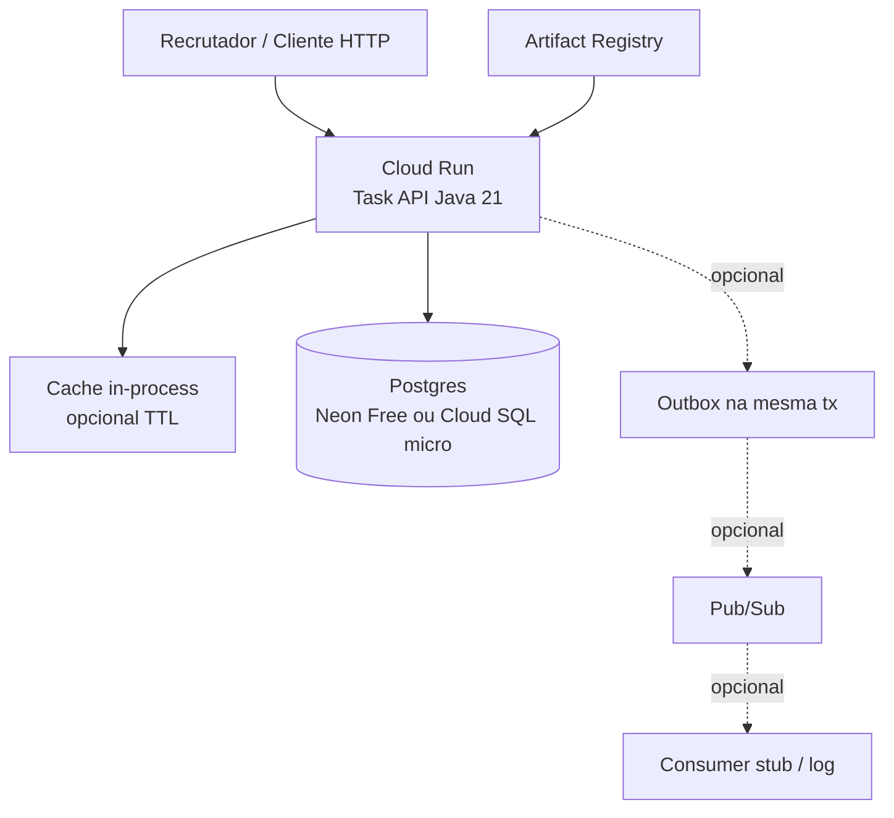

# Portfólio GCP — Task Management API (Java 21)

Documento de **arquitetura e orçamento** para publicar a API REST de tasks no Google Cloud de forma **barata**, adequada a **portfólio público** (demo para recrutadores).  
Só especificação — **não** implementa infraestrutura.

| Campo | Valor |
|-------|--------|
| **Projeto local** | `/run/media/wroc/dev/projects/projects-backend/java/beginner/01-simple-rest-api-task-management` |
| **Arquitetura alvo local** | `ARCHITECTURE-V2.md` (Postgres fonte da verdade, Outbox → RabbitMQ, Redis cache-aside, HTTP nativo JDK, Docker) |
| **Stack atual (V1)** | Java 21 · HTTP Server nativo · InMemory · Redis/Rabbit no Compose (ainda não wired) |
| **Data da pesquisa de preços** | **6 de outubro de 2026** |
| **Cotação USD→BRL** | **R$ 4,97 / USD** (aprox.; Trading Economics ~4,966; Investing ~4,966; dollarfx 4,982 — 06/10/2026) |
| **Região preferida (custo)** | `us-central1` (Iowa) — Cloud Run Tier 1 + Always Free alinhado |
| **Região latência BR** | `southamerica-east1` (São Paulo) — mais cara (Cloud Run Tier 2; Cloud SQL ~+50%) |

> Valores em USD com conversão BRL usando **4,97**. Arredondamentos são conservadores. Links oficiais na seção [Fontes](#13-fontes-de-preço-e-documentação).

---

## 1. Objetivo e princípios

1. **Demo estável** para recrutador bater na API (CRUD `/tasks`) sem fatura surpresa.
2. **Barato no idle** (maior parte do tempo a API fica sem tráfego).
3. **Mostrar decisões de engenharia** (trade-offs claros vs `ARCHITECTURE-V2.md`), não só “subi no cloud”.
4. **Evitar Memorystore Redis** e VMs 24×7 desnecessárias.
5. Preferir **scale-to-zero** no compute e **Postgres gerenciado barato** (Neon free ou Cloud SQL micro).

---

## 2. O que mudamos em relação à ARCHITECTURE-V2

A V2 local é ótima para lab (Compose/K8s): Postgres + Outbox + Redis + Rabbit. No GCP de portfólio, **espelhar 1:1 fica caro e pouco didático**.

| Peça V2 | No GCP portfólio | Motivo |
|---------|------------------|--------|
| PostgreSQL | **Neon Free** (recomendado) ou Cloud SQL `db-f1-micro` | Neon: $0 com scale-to-zero; Cloud SQL micro: ~US$ 8–12/mês **mesmo idle** |
| Redis cache-aside | **Omitir** ou cache **in-process** (Caffeine/`ConcurrentHashMap` com TTL) | Memorystore Basic 1 GiB ≈ **US$ 35+/mês** — inviável para demo |
| RabbitMQ + Outbox Relay | **Omitir no MVP cloud** *ou* Pub/Sub (barato no free 10 GiB) | Sem consumers reais, a fila só gera custo/ops; Pub/Sub cabe no Always Free para volume de lab |
| Outbox na mesma tx | Manter **só se** houver Pub/Sub/consumer; senão simplificar writes | Outbox sem consumidor é complexidade sem valor de portfólio |
| N réplicas API | Cloud Run escala sob demanda (concurrency) | Não precisa Deployment K8s |
| Compose Redis/Rabbit | Não provisionar no cloud | Ficam no lab local |

**O que se perde vs V2**

- Não demonstra Redis compartilhado nem invalidação distribuída.
- Não demonstra RabbitMQ / AMQP (troca por Pub/Sub ou nada).
- Cold start Cloud Run (~1–3 s) e, com Neon Free, cold start do DB após ~5 min idle.
- Cloud SQL micro **não tem SLA** (shared-core).
- Menos “parecido com produção enterprise”, mais “custo-benefício de portfólio”.

**O que se mantém**

- Postgres como **fonte da verdade**.
- API Java 21 em container.
- Ports/Clean Architecture (adapters trocam Redis→in-memory cache, Rabbit→Pub/Sub ou no-op).
- Health check HTTP.

---

## 3. Arquitetura recomendada (portfólio barato)

### 3.1 Diagrama textual

```text
Internet (recrutador / curl / Postman)
        │
        ▼
  URL *.run.app  (ou domínio custom + Cloud DNS — opcional, +US$ ~0,20/zona)
        │
        ▼
┌───────────────────────────────────────┐
│  Cloud Run  (Java 21 API)             │
│  • 1 vCPU / 512 MiB                   │
│  • min instances = 0 (scale-to-zero)  │
│  • request-based billing              │
│  • concurrency ~80                    │
│  • cache opcional in-process          │
└───────────────┬───────────────────────┘
                │ JDBC (TLS)
                ▼
┌───────────────────────────────────────┐
│  Neon Postgres Free  (recomendado)    │
│  ou Cloud SQL PostgreSQL db-f1-micro  │
│  tabelas: tasks (+ outbox se Pub/Sub) │
└───────────────────────────────────────┘

Opcional (faixa média):
  Outbox Relay (thread na API ou Cloud Run Job) → Pub/Sub topic → push/pull stub

Imagem: Artifact Registry (≤0.5 GiB free)
Sem: Memorystore, GKE, Load Balancer dedicado, RabbitMQ gerenciado
```

### 3.2 Diagrama Mermaid



### 3.3 Fluxo de request (MVP cloud)

```text
GET/POST/PUT/PATCH/DELETE /tasks
  → Cloud Run instancia container (ou reutiliza warm)
  → TaskService → Postgres (fonte da verdade)
  → (opcional) evict cache in-process
  → resposta JSON
```

Sem Redis/Rabbit no caminho crítico do MVP público.

---

## 4. Comparação das opções mais baratas

### 4.1 Compute

| Opção | Idle (sem tráfego) | Pico leve | Ops | Adequação portfólio |
|-------|--------------------|-----------|-----|---------------------|
| **Cloud Run** (recomendado) | **~$0** com min=0 + free tier | Cents ou free | Baixa | **Melhor** |
| **GCE e2-micro** Always Free | $0 em regiões US elegíveis | Limitado (shared) | Média (patch, SSH) | Ok se quiser VM; cold não existe, mas você opera SO |
| **App Engine Standard** | Free daily quota (F1) | Baixo | Baixa | Menos flexível p/ container Java custom |
| **GKE Autopilot** | Cluster/workload mínimo caro demais p/ demo | Overkill | Alta | **Não** para portfólio iniciante |
| Cloud Run + **min instances=1** | ~US$ 5–15+/mês idle | Sem cold start | Baixa | Só se cold start for inaceitável |

**Preços Cloud Run (request-based, Tier 1, ex. us-central1)** — [cloud.google.com/run/pricing](https://cloud.google.com/run/pricing):

| Recurso | Preço | Free tier / mês |
|---------|-------|-----------------|
| CPU ativa | US$ 0,000024 / vCPU-segundo | 180.000 vCPU-s |
| Memória ativa | US$ 0,0000025 / GiB-segundo | 360.000 GiB-s |
| Requests | US$ 0,40 / milhão | 2 milhões |
| Idle (min instances) | US$ 0,0000025 / vCPU-s e / GiB-s | — (evite min>0) |

`southamerica-east1` é **Tier 2** (mais caro). Para portfólio barato: deploy em **us-central1**; aceite ~120–200 ms a mais de latência do Brasil.

**Estimativa idle Cloud Run:** US$ **0,00** (scale-to-zero).  
**Estimativa pico leve** (ex.: 5.000 req/mês, 200 ms, 1 vCPU, 512 MiB, concurrency 20): **dentro do free tier** → US$ **0,00** de compute.  
*(Exemplo oficial GCP: 10 M req/mês ≈ US$ 13,69 — muito acima de tráfego de portfólio.)*

### 4.2 Banco de dados

| Opção | Custo mensal típico | Prós | Contras |
|-------|---------------------|------|---------|
| **Neon Free** | **US$ 0** | Scale-to-zero, 1 GB storage/projeto, Postgres real | Cold start ~5 min idle; limit 100 CU-h/projeto; egress 5 GB |
| **Cloud SQL `db-f1-micro`** | **~US$ 7,67** instância + storage (~US$ 9,37 c/ 10 GB em us-central1) | Tudo no GCP; backups gerenciados | Cobra **24×7** mesmo idle; sem SLA shared-core; São Paulo mais caro (~US$ 12 só instância) |
| **AlloyDB** | Dezenas–centenas USD | Performance | **Longe** do budget de portfólio |
| **Postgres em GCE e2-micro** | $0 compute (Always Free) + disco | Barato | Você vira DBA (backup, update, segurança); ruim para “production story” |
| **Supabase Free** | US$ 0 | Postgres + extras | Pause após 1 semana inativo; 500 MB DB — ok p/ demo com caveat |

**Cloud SQL shared-core** ([pricing](https://cloud.google.com/sql/pricing)):

| Tipo | Preço | ≈ mês (730 h) |
|------|-------|----------------|
| `db-f1-micro` | US$ 0,0105 / h | **~US$ 7,67** |
| HA `db-f1-micro` | US$ 0,021 / h | ~US$ 15,33 — **não** use HA em portfólio |
| SSD storage | ~US$ 0,17 / GiB-mês (us-central1, ordem de grandeza) | 10 GiB ≈ US$ 1,70 |
| Exemplo oficial | micro + 10 GB, us-central1 | **US$ 9,37/mês** |

**Neon Free** ([neon.com/docs/introduction/plans](https://neon.com/docs/introduction/plans)): US$ 0; 1 GB Postgres/projeto; 100 CU-h; scale-to-zero 5 min; 5 GB egress/projeto.

### 4.3 Mensageria e cache

| Opção | Custo portfólio | Veredito |
|-------|-----------------|----------|
| **Omitir** async + cache externo | US$ 0 | **MVP cloud recomendado** |
| **Pub/Sub** | 10 GiB throughput free/mês; depois US$ 40/TiB | Ótimo se quiser mostrar Outbox→evento |
| **Memorystore Redis** Basic M1 (1–4 GiB) | **US$ 0,049 / GiB-h** → 1 GiB × 730 ≈ **US$ 35,8/mês** | **Não** para portfólio |
| Redis em e2-micro | $0 + ops | Possível, mas compete com Always Free da API/DB |

### 4.4 Registry, DNS, rede

| Serviço | Preço relevante | Portfólio |
|---------|-----------------|-----------|
| **Artifact Registry** | 0,5 GiB free; depois ~US$ 0,10/GB-mês | Imagem Java slim cabe no free |
| **Cloud DNS** | ~US$ 0,20/zona/mês + US$ 0,40/milhão queries; **sem free tier** | Opcional; use `*.run.app` de graça |
| **Load Balancing** | Forwarding rules + US$ 0,008/GiB processado | **Evite**; Cloud Run já expõe HTTPS |
| **Egress** | Cloud Run: 1 GiB free NA (Premium); Standard Tier pode ter 200 GiB free/região | Demo de API JSON: egress irrelevante |

### 4.5 Free tier / trial

| Benefício | Detalhe |
|-----------|---------|
| **Always Free** | Cloud Run (2 M req, 180k vCPU-s, 360k GiB-s); Pub/Sub 10 GiB; Artifact Registry 0,5 GiB; e2-micro em regiões US; etc. |
| **Free Trial** | **US$ 300** créditos / **90 dias** (novos clientes elegíveis) |
| **Cloud SQL free trial** | Trial de produto (ex. 30 dias Enterprise Plus) — **não** confundir com Always Free; após trial, micro cobra mensal |
| **Neon / Supabase Free** | Alternativa $0 permanente ao Cloud SQL para demo |

Fonte: [Free cloud features](https://docs.cloud.google.com/free/docs/free-cloud-features), [cloud.google.com/free](https://cloud.google.com/free).

---

## 5. Orçamento estimado (USD e BRL)

**Cotação:** 1 USD = **R$ 4,97** (06/10/2026).  
Horas/mês usadas nos cálculos: **730**.

### 5.1 Cenário A — Idle / só demo (quase zero tráfego)

| Serviço | Faixa $0–5 (recomendada) | Faixa Cloud SQL |
|---------|---------------------------|-----------------|
| Cloud Run (min=0) | US$ 0,00 | US$ 0,00 |
| Banco | Neon Free **US$ 0,00** | Cloud SQL micro+10 GB **~US$ 9,37** |
| Artifact Registry | US$ 0,00 (≤0,5 GiB) | US$ 0,00 |
| Pub/Sub / Redis / DNS | US$ 0,00 (omitidos) | US$ 0,00 |
| **Total** | **US$ 0–2** ≈ **R$ 0–10** | **US$ 9–12** ≈ **R$ 45–60** |

> Cloud SQL **não** escala a zero: idle ≈ pico de custo fixo do banco.

### 5.2 Cenário B — Pico leve (recrutador batendo na API)

Suposições conservadoras: ~5.000–50.000 requests/mês, payloads JSON pequenos, latência média 100–400 ms, 1 vCPU / 512 MiB.

| Serviço | Faixa $0–5 | Com Cloud SQL | Com extras |
|---------|------------|---------------|------------|
| Cloud Run | US$ 0 (free tier) | US$ 0–1 | US$ 0–3 |
| Banco | Neon US$ 0 (dentro CU-h) | US$ 9–12 | US$ 9–12 |
| Pub/Sub (opcional) | US$ 0 | US$ 0 | US$ 0–1 |
| Egress / DNS | US$ 0 | US$ 0–0,50 | +US$ 0,20 DNS |
| **Total** | **US$ 0–5** ≈ **R$ 0–25** | **US$ 10–15** ≈ **R$ 50–75** | **US$ 15–25** ≈ **R$ 75–125** |

### 5.3 O que estoura o budget (evitar)

| Armadilha | Custo aproximado |
|-----------|------------------|
| Memorystore Redis 1 GiB Basic | **~US$ 36/mês** (R$ ~180) |
| Cloud SQL HA | 2× instância |
| GKE Autopilot “mínimo” | Dezenas USD + complexidade |
| Cloud Run min instances = 1 (1 vCPU, 512 MiB idle) | Ordem de **US$ ~5–15+/mês** só de idle (estimativa; depende região/billing) |
| AlloyDB / Enterprise Plus | Fora de escopo portfólio |
| IP público ocioso / discos órfãos / NAT | Surpresas clássicas de fatura |

---

## 6. Recomendação por faixa de budget

### Faça isto se o budget for **~US$ 0–5/mês** (≈ **R$ 0–25**)

**Stack:** Cloud Run (scale-to-zero, us-central1) + **Neon Free** + Artifact Registry + URL `*.run.app` + **sem** Memorystore + **sem** Pub/Sub no MVP + cache in-process opcional.

- Melhor custo/benefício para portfólio.
- Documente no README: “cloud MVP simplifica V2 (sem Redis/Rabbit)”.
- Use créditos US$ 300 só como colchão; arquitetura deve sobreviver **sem** créditos.

### Faça isto se o budget for **~US$ 5–15/mês** (≈ **R$ 25–75**)

**Stack:** Cloud Run + **Cloud SQL `db-f1-micro`** (us-central1, SSD 10 GB, **sem HA**) + Artifact Registry + opcional Pub/Sub (Outbox demo).

- Tudo (quase) dentro do GCP — bom para narrativa “GCP end-to-end”.
- Aceite custo fixo ~US$ 9–12 mesmo sem visitas.
- Alternativa na mesma faixa: Neon Free + Cloud Run + domínio custom (Cloud DNS ~US$ 0,20) + Pub/Sub.

### Faça isto se o budget for **~US$ 15–40/mês** (≈ **R$ 75–200**)

**Stack:** Cloud Run (talvez min=1 se quiser eliminar cold start) + Cloud SQL micro (ou g1-small se precisar) + Pub/Sub + Cloud DNS + logging generoso.

- Ainda **não** inclua Memorystore; use cache in-process ou Redis só em Compose local.
- São Paulo (`southamerica-east1`) cabe aqui se latência BR for prioridade (Cloud SQL + Run mais caros).
- GKE / AlloyDB / HA continuam **desnecessários**.

---

## 7. Mapa V2 → Cloud (adapters)

| Port / peça | Lab local (V2) | Portfólio GCP |
|-------------|----------------|---------------|
| `TaskRepository` | Postgres (Compose) | Neon ou Cloud SQL |
| `OutboxWriter` + Relay | RabbitMQ | No-op **ou** Pub/Sub publisher |
| `TaskCache` | Redis | In-process TTL **ou** no-op |
| Deploy | Compose / K8s | Cloud Run + Artifact Registry |
| Secrets | env Compose | Secret Manager (free até limites) ou env Cloud Run |
| Observabilidade | logs locais | Cloud Logging (50 GiB free/mês Always Free) |

---

## 8. Checklist de deploy (alto nível)

Sem scripts longos — ordem sugerida:

1. **Conta GCP** + billing; se elegível, Free Trial US$ 300 / 90 dias.
2. **Criar budget + alertas** (50%, 90%, 100% de US$ 10 e US$ 25) **antes** de provisionar banco.
3. Ativar APIs: Cloud Run, Artifact Registry, Cloud SQL (se usar), Pub/Sub (se usar), Secret Manager.
4. Escolher região: `us-central1` (barato) ou `southamerica-east1` (latência).
5. **Banco:** criar projeto Neon Free **ou** instância Cloud SQL Postgres `db-f1-micro` (SSD 10 GB, sem HA, backups sob demanda/leve).
6. Rodar migrações (`tasks`; `outbox_events` só se for usar Pub/Sub).
7. Build da imagem Java 21 (Dockerfile multi-stage) → push Artifact Registry.
8. Deploy Cloud Run: 512 MiB, 1 vCPU, min instances **0**, concurrency alta, CPU request-based, porta 8080, env `DATABASE_URL` / secrets.
9. Permitir acesso público não autenticado **ou** IAM invoker + documentação de como chamar (portfólio costuma ser público).
10. Smoke test: `GET/POST /tasks` da URL `*.run.app`.
11. (Opcional) Pub/Sub topic + relay + consumer stub que só loga.
12. (Opcional) Domínio: Cloud DNS zona + mapeamento de domínio no Cloud Run.
13. README do repo: URL pública, arquitetura cloud vs V2, aviso de cold start, custo esperado.
14. Revisar Billing report na 1ª semana; apagar recursos órfãos.

---

## 9. Como evitar surpresa de fatura

1. **Budgets** no Cloud Billing com alertas por e-mail (e Pub/Sub se quiser automação).
2. **Caps mentais:** se passar de US$ 15/mês sem motivo, investigue — Memorystore, HA, disco, IPs.
3. Cloud Run: **min instances = 0**; não ligue GPU; não use instance-based billing sem necessidade.
4. Cloud SQL: **sem HA**; pare/delete se não for usar por meses (export schema antes); prefira Neon se idle longo.
5. Desligue **Serverless VPC Connector** se não precisar de VPC (custa compute).
6. Evite Load Balancer global “por costume”.
7. Limpe imagens antigas no Artifact Registry.
8. Após Free Trial: upgrade consciente; Always Free **não** cobre Cloud SQL micro.
9. Label em todos os recursos (`env=portfolio`, `project=tasks-api`) para filtrar no billing.
10. Documente: “este ambiente é demo; dados podem ser apagados”.

> GCP **não** oferece “hard cap” universal que desliga tudo automaticamente em todos os produtos; budgets alertam — a disciplina é sua (e do alerta).

---

## 10. Decisão arquitetural resumida (ADR)

| ID | Decisão | Status |
|----|---------|--------|
| GCP-001 | Cloud Run scale-to-zero como compute | Aceito |
| GCP-002 | Neon Free como Postgres default do portfólio; Cloud SQL micro se “all-in GCP” | Aceito |
| GCP-003 | Sem Memorystore no portfólio | Aceito |
| GCP-004 | Pub/Sub opcional; omitir outbox/async no MVP cloud | Aceito |
| GCP-005 | Cache in-process opcional; Redis só no lab Compose | Aceito |
| GCP-006 | Região us-central1 para custo; São Paulo só se budget ≥ ~US$ 15 | Aceito |
| GCP-007 | URL `*.run.app` sem Cloud DNS no MVP | Aceito |

---

## 11. Hipótese validada

> Hipótese inicial: *Cloud Run (scale-to-zero) + Cloud SQL db-f1-micro **OU** Neon free + Pub/Sub (ou omitir) + Artifact Registry + sem Memorystore*.

**Validação com preços de out/2026:**

| Parte | Resultado |
|-------|-----------|
| Cloud Run | Confirmado — free tier cobre idle + pico leve de portfólio |
| Neon Free | Confirmado — **melhor** para idle US$ 0 |
| Cloud SQL micro | Confirmado como opção “all GCP”, mas **piso ~US$ 9/mês** |
| Pub/Sub | Confirmado barato (10 GiB free); omitir no MVP é ok |
| Sem Memorystore | Confirmado — ~US$ 36/mês inviável |
| Artifact Registry | Confirmado free até 0,5 GiB |

**Recomendação inequívoca:** começar na faixa **US$ 0–5** (Cloud Run + Neon). Subir para Cloud SQL só se quiser narrativa 100% GCP e aceitar ~US$ 10/mês fixos.

---

## 12. Resumo executivo (1 parágrafo)

Para o portfólio público da Task API Java 21, a arquitetura barata é **Cloud Run com scale-to-zero** + **Neon Postgres Free** (ou Cloud SQL `db-f1-micro` se o budget permitir ~US$ 10/mês fixos), **sem Redis gerenciado** e **sem RabbitMQ**; mensageria só via **Pub/Sub** se quiser demonstrar Outbox. Isso preserva Postgres como fonte da verdade e sacrifica propositalmente o espelhamento 1:1 da V2 local (Redis/Rabbit) em troca de custo previsível e demo estável para recrutadores.

---

## 13. Fontes de preço e documentação

Pesquisa em **6 de outubro de 2026**. Preferência por páginas oficiais Google Cloud / Neon.

| Tema | URL |
|------|-----|
| Cloud Run pricing | https://cloud.google.com/run/pricing |
| Cloud SQL pricing | https://cloud.google.com/sql/pricing |
| Cloud SQL pricing examples (Postgres) | https://cloud.google.com/sql/docs/postgres/pricing-examples |
| Pub/Sub pricing | https://cloud.google.com/pubsub/pricing |
| Artifact Registry pricing | https://cloud.google.com/artifact-registry/pricing |
| Memorystore for Redis pricing | https://cloud.google.com/memorystore/docs/redis/pricing |
| Cloud DNS pricing | https://cloud.google.com/dns/pricing |
| Network / egress | https://cloud.google.com/vpc/network-pricing |
| Load Balancing pricing | https://cloud.google.com/load-balancing/pricing |
| Free Trial / Always Free | https://cloud.google.com/free · https://docs.cloud.google.com/free/docs/free-cloud-features |
| Neon plans | https://neon.com/docs/introduction/plans |
| Supabase pricing (alternativa) | https://supabase.com/pricing |
| Cotação USD/BRL 06/10/2026 | https://tradingeconomics.com/brazil/currency · https://www.investing.com/currencies/usd-brl-historical-data |

**Calculadora oficial:** https://cloud.google.com/products/calculator — use para recalcular antes de qualquer deploy pago.

---

## 14. Glossário rápido (cloud)

| Termo | Significado aqui |
|-------|------------------|
| Scale-to-zero | Serviço sobe sob demanda e não cobra idle (Cloud Run min=0; Neon Free) |
| Cold start | Latência extra na 1ª request após idle |
| Shared-core | CPU compartilhada (Cloud SQL micro) — barato, sem SLA |
| Always Free | Cotas mensais gratuitas permanentes (sujeitas a mudança) |
| Tier 1 / Tier 2 | Faixas de preço regional do Cloud Run |

---

*Documento do braço Arquiteto Google Cloud — apenas especificação de portfólio. Implementação de infra fica para etapa posterior autorizada.*
